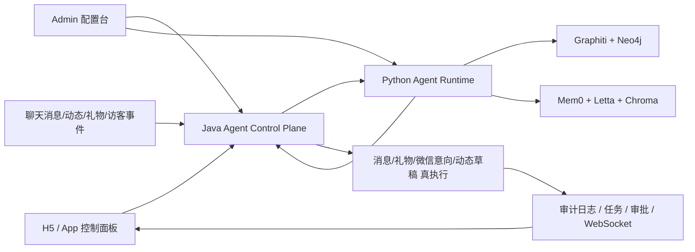

# Autonomous Love Companion Agent Implementation Plan

> **For agentic workers:** REQUIRED SUB-SKILL: Use superpowers:subagent-driven-development (recommended) or superpowers:executing-plans to implement this plan task-by-task. Steps use checkbox (`- [ ]`) syntax for tracking.

**Goal:** 一次性把 AiLeMe 的“智能恋爱助手”升级成可长期经营关系、可自主触发、可多对象并行、可结合智能画像与关系图谱做策略推理、并可在用户授权下真实执行消息/邀约/微信交换建议/礼物/动态草稿的自治恋爱 Agent。

**Architecture:** 继续坚持 `Java 负责业务真执行与治理`、`Python runtime 负责智能推理与长流程工作流`。Java 侧新增关系状态缓存、事件摄取、程序调度、审批与审计；Python runtime 新增画像融合、恋爱大师风格推理、关系阶段评估、LangGraph 工作流、Graphiti/Neo4j 关系图谱更新与长期记忆回写；H5 和管理后台升级为“控制平面 + 执行观测台”。

**Tech Stack:** Spring Boot 3.5.x, MyBatis Plus, Sa-Token, FastAPI, Pydantic, LangGraph, Graphiti, Neo4j, ChromaDB, Mem0, Letta, uni-app Vue3, Vue3 + Element Plus Admin, MySQL, Redis, WebSocket.

---

## 0. 一次性实现的定义

这里的“一次性实现”不是说一天里写完全部代码，而是：

- 同一个版本内交付完整闭环，不做“先半自动、后自治”的产品拆分
- 研发内部可以按工作流顺序推进，但上线范围是一个完整自治恋爱助手
- 功能交付标准不是“能点按钮”，而是“能持续经营关系”

最终上线结果必须同时满足：

1. 支持多对象并行陪聊
2. 支持对方来消息自动回
3. 支持在静默/频率/白名单/关系风险约束下主动发消息
4. 支持结合智能红娘推荐的对象主动展开私信聊天
5. 支持聊天连续 3 天、回合数、热度、回复质量等条件触发邀约或微信交换评估
6. 支持结合智能画像与“恋爱大师风格库”选择最合适的话术风格
7. 支持关系进度评估、执行计划、任务日志、审批门、失败回滚
8. 支持 Java 真执行，Python 不越权直写业务

## 1. 研究结论与设计借鉴

### 1.1 OpenClaw 的可迁移思路

根据 OpenClaw 官方文档：

- skills 是代码注册和环境过滤后的受控能力，而不是任意工具调用
- standing orders 是“永久操作授权 + 触发器 + 审批门 + 升级规则”的组合
- cron 只是触发时机，真正的自治来自 standing orders

对 AiLeMe 的直接映射：

- 每个对象都不是一个“聊天框”，而是一份 `relationship program`
- 每个 program 有：
  - scope：允许代聊、允许主动发起、允许礼物、允许邀约、允许微信交换建议
  - triggers：对方来消息、空窗 24h、连续聊 3 天、累计回合数、情绪升温、活跃时段
  - approval gates：金额、陌生对象、夜间、第一次邀约、第一次换微信
  - escalation rules：冷淡、拒绝、风险上升、预算超额、模型不确定

### 1.2 LangGraph 的可迁移思路

根据 LangGraph 官方说明，其强项是：

- durable execution
- human-in-the-loop

对 AiLeMe 的直接映射：

- 恋爱助手不是“单次问答”，而是可恢复、可中断、可审批的长流程工作流
- 每个对象应该有独立 workflow run，可在中间停在：
  - 等待对方回复
  - 等待用户审批
  - 等待定时窗口
  - 等待预算重置

### 1.3 Graphiti 的可迁移思路

根据 Graphiti 官方说明：

- 图谱是 temporal context graph
- facts/relationships 带 validity windows
- 查询支持时间、语义、关系三种维度

对 AiLeMe 的直接映射：

- 不能只存“当前阶段”，必须存“阶段是怎么演变过来的”
- 同一个对象的关系事实会变化，例如：
  - 喜欢深夜聊天 → 后续变成不喜欢深夜打扰
  - 愿意线下见面 → 后续被一次拒绝打断
- 关系评估必须同时能回答：
  - 现在是什么阶段
  - 为什么是这个阶段
  - 哪些信号让阶段升高/降低

### 1.4 Mem0 / Letta 的可迁移思路

根据官方说明：

- Mem0 适合偏事实型、偏偏好型、可复用的长期记忆层
- Letta 适合更 stateful 的伴侣型会话连续性

对 AiLeMe 的直接映射：

- Mem0 用于：
  - 对方偏好
  - 禁忌
  - 聊过的承诺
  - 约会反馈
  - 微信交换条件
- Letta 用于：
  - “这个助手是怎么陪这个用户谈恋爱的”
  - 长时间多对象经营中的主人偏好和边界

### 1.5 智能画像与“恋爱大师风格库”的结合

这不是单纯的 prompt style。

正确做法是：

- 先用智能画像推断目标对象的：
  - attachment style
  - emotional style
  - openness / stability / engagement
  - preferred romance pace
  - disliked interaction patterns
  - attraction hooks
- 再从“恋爱大师风格库”中选择最适配的 coach style：
  - 温柔安全感型
  - 轻松幽默型
  - 成熟稳重型
  - 生活感靠谱型
  - 仪式感浪漫型
  - 轻推进邀约型
- 最后由模型在该风格约束下生成具体内容，而不是硬套固定模板

我对这些资料的推断是：

- OpenClaw 给了“程序化授权”的框架
- LangGraph 给了“长流程自治”的框架
- Graphiti 给了“关系是随时间变化的事实网络”的框架
- Mem0 / Letta 给了“记忆分层”的框架
- 你们现有智能画像则提供“恋爱大师风格选择”的个性化基础

## 2. 最终产品形态

### 2.1 用户侧

在现有“智能恋爱助手”入口里升级为 5 个面板：

1. `关系总览`
   - 多对象列表
   - 每位对象当前阶段
   - 热度趋势
   - 风险提醒
   - 今日计划
2. `自动陪聊`
   - 自动回复开关
   - 主动发起开关
   - 多对象选择
   - 每日动作上限
   - 夜间静默
3. `关系推进计划`
   - 本周目标
   - 今日下一步
   - 邀约 readiness
   - 微信 readiness
4. `执行记录`
   - 发了什么
   - 为什么发
   - 触发器来源
   - 是否审批
5. `画像与风格`
   - 对方画像摘要
   - 当前推荐恋爱大师风格
   - 禁忌与注意点

同时增加第 6 个来源面板：

6. `红娘起聊池`
   - 智能红娘推荐对象列表
   - 每位对象的起聊价值分
   - 推荐的第一条私信
   - 是否允许助手自动破冰
   - 自动破冰后是否转入长期 relationship program

### 2.2 对象级 Program

每个 owner-target 组合是一条独立的 `relationship program`，不是全局一个大开关。

每条 program 至少包含：

- target_uid
- enabled
- auto_reply_enabled
- proactive_message_enabled
- date_escalation_enabled
- wechat_exchange_eval_enabled
- gift_plan_enabled
- gift_execute_enabled
- moment_draft_enabled
- quiet_hours
- allowed_days
- max_actions_per_day
- max_messages_per_day
- program_strategy_json
- current_relationship_stage
- date_ready_score
- wechat_ready_score
- current_master_style_code

### 2.3 从智能红娘进入恋爱助手

关系 program 的来源不止已有好友/已有会话，还包括：

- `existing_chat`
- `hongniang_recommendation`
- `mutual_interest`
- `profile_visit_signal`

对于 `hongniang_recommendation` 来源：

- runtime 先用智能红娘输出的 `icebreak_openers`
- 再结合目标画像和恋爱大师风格做改写
- 第一条起聊属于 `proactive_opening_send`
- 一旦对方承接回复，即自动升级为常规 `relationship program`

## 3. 目标架构



### 3.1 Java 控制平面职责

- 接收聊天、动态、礼物、访客等事件
- 做授权、预算、对象范围、审批门校验
- 决定是否调用 runtime
- 创建 `agent_action_task`
- 创建 `agent_action_approval`
- 执行消息、礼物、微信意向、动态草稿
- 将执行结果回灌给 runtime
- 给 H5 提供对象级状态与计划读取接口

### 3.2 Python runtime 智能层职责

- 聚合画像、记忆、图谱、聊天上下文
- 计算关系阶段与 readiness 分数
- 选择恋爱大师风格
- 输出自治计划和具体动作建议
- 通过 LangGraph 保存 workflow state
- 把事实写入 Mem0 / Graphiti / Neo4j / runtime trace

### 3.3 图谱与记忆层职责

- Graphiti：
  - 关系事实时序更新
  - 约会/微信交换 readiness 的时间型证据
- Neo4j：
  - 关系图查询
  - explainability
  - 社交链和风险链分析
- Mem0：
  - 偏好、禁忌、承诺、有效话题、失败动作
- Letta：
  - 主人级长期陪伴上下文
  - 主人偏好与恋爱策略倾向

## 4. 关键智能对象模型

### 4.1 关系状态快照 `relationship_state`

每个对象都要持续维护：

- `stage_code`
  - cold
  - early
  - warming
  - flirting
  - trust_building
  - date_ready
  - date_proposed
  - wechat_ready
  - wechat_exchanged
  - cooling
- `heat_score`
- `trust_score`
- `response_balance_score`
- `date_ready_score`
- `wechat_ready_score`
- `gift_acceptance_score`
- `risk_score`
- `recommended_next_action`
- `recommended_master_style_code`
- `stage_reasoning_summary`

### 4.2 恋爱大师风格 `coach_style`

新增“风格不是模板、而是策略约束”：

- `warm_guardian`
  - 提供安全感，适合慢热、敏感依恋
- `playful_tease`
  - 轻松幽默，适合高互动、接受玩笑的人
- `steady_partner`
  - 稳定靠谱，适合长期关系导向
- `romantic_signal`
  - 仪式感浪漫，适合高表达型对象
- `life_companion`
  - 生活感自然推进，适合同城、真实生活场景
- `invitation_driver`
  - 在 readiness 足够时做低压邀约推进

风格选择必须由模型结合智能画像推断，不允许用户写死“永远用某种大师套路”。

### 4.3 触发器 `relationship_trigger`

必须内置以下触发器：

- `incoming_message`
- `incoming_message_after_long_gap`
- `owner_idle_24h`
- `owner_idle_72h`
- `conversation_round_threshold`
- `three_day_stable_chat`
- `high_positive_response`
- `negative_cooling_signal`
- `gift_followup_window`
- `post_interaction_window`
- `date_ready_window`
- `wechat_ready_window`

### 4.4 动作 `relationship_action`

- `reply_draft`
- `reply_send`
- `hongniang_opening_draft`
- `hongniang_opening_send`
- `proactive_opening_send`
- `topic_switch_send`
- `date_invite_draft`
- `date_invite_send`
- `wechat_exchange_eval`
- `wechat_request_draft`
- `wechat_request_send`
- `gift_plan_generate`
- `gift_execute`
- `moment_draft_generate`

## 5. 关键业务规则

### 5.1 “聊满三天邀约”不能写死成规则

正确实现是：

- `3 天稳定互动` 只是强信号，不是直接邀约条件
- 必须同时判断：
  - 双方回复时延是否缩短
  - 内容是否从表层话题进入生活层
  - 对方是否有开放性回应
  - 是否存在拒绝/回避/降温信号
- runtime 输出 `date_ready_score`
- Java 根据 program 配置决定：
  - 只生成邀约草稿
  - 创建审批
  - 自动发送低压邀约

### 5.2 “多少轮后交换微信”也不能写死

正确实现是：

- `conversation_round_count` 只是输入特征之一
- 必须叠加：
  - trust_score
  - self_disclosure_depth
  - off_platform openness
  - negative risk
  - recent acceptance patterns
- runtime 输出：
  - `wechat_ready_score`
  - `wechat_request_reasoning`
  - `wechat_best_timing_window`
  - `wechat_request_style`

### 5.3 主动发消息必须有节奏模型

主动发消息不能是固定间隔 cron：

- 需要结合对方活跃时间
- 需要结合前一次互动结果
- 需要避免追击式发送
- 需要区分：
  - 红娘推荐首轮破冰主动
  - 破冰主动
  - 承接主动
  - 低压维系
  - 邀约主动

## 6. 数据设计

### 6.1 Java 侧新增表

**Create:** `sql/agent_autonomy_release.sql`

新增：

- `agent_target_setting`
  - owner_user_id
  - target_user_id
  - enabled
  - auto_reply_enabled
  - proactive_enabled
  - date_enabled
  - wechat_eval_enabled
  - coach_style_override
  - quiet_hours_json
  - action_limit_json
  - policy_json
- `agent_relationship_snapshot`
  - owner_user_id
  - target_user_id
  - stage_code
  - heat_score
  - trust_score
  - date_ready_score
  - wechat_ready_score
  - risk_score
  - current_master_style_code
  - next_action_code
  - next_action_summary
  - last_runtime_trace_id
  - snapshot_json
- `agent_program_run`
  - run_id
  - owner_user_id
  - target_user_id
  - trigger_code
  - workflow_code
  - status
  - task_id
  - approval_id
  - runtime_trace_id
  - result_json
- `agent_trigger_cursor`
  - owner_user_id
  - target_user_id
  - session_id
  - last_message_id
  - last_event_time
  - last_round_count
  - last_stage_code

继续复用：

- `agent_permission`
- `agent_action_task`
- `agent_action_approval`
- `agent_action_log`

### 6.2 Python runtime 侧新增表

**Create:** `ai-le-me-agent-runtime/sql/002_companion_autonomy_tables.sql`

新增：

- `agent_relationship_event`
  - owner_user_id
  - target_user_id
  - event_type
  - event_time
  - source_type
  - event_json
- `agent_relationship_state`
  - owner_user_id
  - target_user_id
  - state_json
  - current_stage
  - master_style_code
  - date_ready_score
  - wechat_ready_score
  - risk_score
- `agent_workflow_checkpoint`
  - workflow_run_id
  - owner_user_id
  - target_user_id
  - trigger_code
  - graph_state_json
  - pending_node
  - resume_token
  - status
- `agent_coach_style_profile`
  - style_code
  - style_name
  - constraints_json
  - prompt_json
  - risk_notes_json

继续复用：

- `agent_memory_profile`
- `agent_memory_fact`
- `agent_action_plan`
- `agent_runtime_trace`

## 7. Java 与 runtime 合同

### 7.1 Java -> runtime 新增接口

**Modify:** `ai-le-me-agent-runtime/agent_runtime/api/routes/companion.py`

新增接口：

- `POST /companion/relationship/evaluate`
  - 输入 owner/target/persona/chat/signals/graph facts/current program
  - 输出 relationship_state
- `POST /companion/program/run`
  - 输入 trigger + current state + permissions
  - 输出 action plan
- `POST /companion/style/select`
  - 输入智能画像 + 目标反馈
  - 输出推荐恋爱大师风格
- `POST /companion/event/ingest`
  - 输入聊天/礼物/动态/约会反馈事件
  - 回写 memory / graph / state

### 7.2 runtime -> Java 结构化输出

所有输出必须是 JSON first：

```json
{
  "relationship_state": {
    "stage_code": "warming",
    "heat_score": 0.72,
    "trust_score": 0.66,
    "date_ready_score": 0.58,
    "wechat_ready_score": 0.41,
    "risk_score": 0.18,
    "master_style_code": "steady_partner"
  },
  "recommended_program": {
    "objective": "build_trust_then_invite",
    "trigger_window": "today_20_00_22_00",
    "next_action_code": "reply_send"
  },
  "suggested_action": {
    "action_type": "reply_send",
    "content": "你上次提到那家店我还记着，最近要是你也想放松一下，我们可以找个轻松点的时间去试试。",
    "risk_level": "medium",
    "requires_approval": false
  },
  "reasoning_summary": "最近 72 小时互动稳定，对方回复积极，但尚未达到直接换微信的时机，更适合先做低压邀约试探。"
}
```

## 8. 文件改动地图

### 8.1 Java App / Governance / Control Plane

**Modify:**

- `/Users/wade/IdeaProjects/RuoYi-Vue-Plus/aileme/ai-le-me-modules/ai-le-me-shejiao-app/src/main/java/td/matrix/app/controller/AppAgentController.java`
- `/Users/wade/IdeaProjects/RuoYi-Vue-Plus/aileme/ai-le-me-modules/ai-le-me-shejiao-app/src/main/java/td/matrix/app/controller/AppRecommendLoveController.java`
- `/Users/wade/IdeaProjects/RuoYi-Vue-Plus/aileme/ai-le-me-modules/ai-le-me-shejiao-app/src/main/java/td/matrix/app/service/agent/AgentOrchestratorService.java`
- `/Users/wade/IdeaProjects/RuoYi-Vue-Plus/aileme/ai-le-me-modules/ai-le-me-shejiao-app/src/main/java/td/matrix/app/service/agent/AgentRuntimeBridgeService.java`
- `/Users/wade/IdeaProjects/RuoYi-Vue-Plus/aileme/ai-le-me-modules/ai-le-me-shejiao-app/src/main/java/td/matrix/app/service/agent/AgentGovernanceService.java`
- `/Users/wade/IdeaProjects/RuoYi-Vue-Plus/aileme/ai-le-me-modules/ai-le-me-shejiao-app/src/main/java/td/matrix/app/service/impl/RecommendLoveServiceImpl.java`
- `/Users/wade/IdeaProjects/RuoYi-Vue-Plus/aileme/ai-le-me-modules/ai-le-me-shejiao-app/src/main/java/td/matrix/app/service/impl/SocialIntentService.java`
- `/Users/wade/IdeaProjects/RuoYi-Vue-Plus/aileme/ai-le-me-modules/ai-le-me-shejiao-app/src/main/java/td/matrix/app/service/impl/ChatMessageServiceImpl.java`

**Create:**

- `/Users/wade/IdeaProjects/RuoYi-Vue-Plus/aileme/ai-le-me-modules/ai-le-me-shejiao-app/src/main/java/td/matrix/app/service/agent/AgentAutonomyService.java`
- `/Users/wade/IdeaProjects/RuoYi-Vue-Plus/aileme/ai-le-me-modules/ai-le-me-shejiao-app/src/main/java/td/matrix/app/service/agent/AgentRelationshipSnapshotService.java`
- `/Users/wade/IdeaProjects/RuoYi-Vue-Plus/aileme/ai-le-me-modules/ai-le-me-shejiao-app/src/main/java/td/matrix/app/service/agent/AgentProgramSchedulerService.java`
- `/Users/wade/IdeaProjects/RuoYi-Vue-Plus/aileme/ai-le-me-modules/ai-le-me-shejiao-app/src/main/java/td/matrix/app/service/agent/AgentChatEventIngestService.java`
- `/Users/wade/IdeaProjects/RuoYi-Vue-Plus/aileme/ai-le-me-modules/ai-le-me-shejiao-app/src/main/java/td/matrix/app/service/agent/AgentMasterStyleService.java`
- `/Users/wade/IdeaProjects/RuoYi-Vue-Plus/aileme/ai-le-me-modules/ai-le-me-shejiao-app/src/main/java/td/matrix/domain/entity/app/AgentTargetSettingEntity.java`
- `/Users/wade/IdeaProjects/RuoYi-Vue-Plus/aileme/ai-le-me-modules/ai-le-me-shejiao-app/src/main/java/td/matrix/domain/entity/app/AgentRelationshipSnapshotEntity.java`
- `/Users/wade/IdeaProjects/RuoYi-Vue-Plus/aileme/ai-le-me-modules/ai-le-me-shejiao-app/src/main/java/td/matrix/domain/entity/app/AgentProgramRunEntity.java`
- `/Users/wade/IdeaProjects/RuoYi-Vue-Plus/aileme/ai-le-me-modules/ai-le-me-shejiao-app/src/main/java/td/matrix/domain/entity/app/AgentTriggerCursorEntity.java`
- `/Users/wade/IdeaProjects/RuoYi-Vue-Plus/aileme/ai-le-me-modules/ai-le-me-shejiao-app/src/main/java/td/matrix/app/dao/AgentTargetSettingDao.java`
- `/Users/wade/IdeaProjects/RuoYi-Vue-Plus/aileme/ai-le-me-modules/ai-le-me-shejiao-app/src/main/java/td/matrix/app/dao/AgentRelationshipSnapshotDao.java`
- `/Users/wade/IdeaProjects/RuoYi-Vue-Plus/aileme/ai-le-me-modules/ai-le-me-shejiao-app/src/main/java/td/matrix/app/dao/AgentProgramRunDao.java`
- `/Users/wade/IdeaProjects/RuoYi-Vue-Plus/aileme/ai-le-me-modules/ai-le-me-shejiao-app/src/main/java/td/matrix/app/dao/AgentTriggerCursorDao.java`

### 8.2 Python Runtime

**Modify:**

- `/Users/wade/IdeaProjects/RuoYi-Vue-Plus/aileme/ai-le-me-agent-runtime/agent_runtime/api/routes/companion.py`
- `/Users/wade/IdeaProjects/RuoYi-Vue-Plus/aileme/ai-le-me-agent-runtime/agent_runtime/schemas/companion.py`
- `/Users/wade/IdeaProjects/RuoYi-Vue-Plus/aileme/ai-le-me-agent-runtime/agent_runtime/services/companion.py`
- `/Users/wade/IdeaProjects/RuoYi-Vue-Plus/aileme/ai-le-me-agent-runtime/agent_runtime/services/intelligence.py`
- `/Users/wade/IdeaProjects/RuoYi-Vue-Plus/aileme/ai-le-me-agent-runtime/agent_runtime/services/persona.py`

**Create:**

- `/Users/wade/IdeaProjects/RuoYi-Vue-Plus/aileme/ai-le-me-agent-runtime/agent_runtime/services/relationship_state.py`
- `/Users/wade/IdeaProjects/RuoYi-Vue-Plus/aileme/ai-le-me-agent-runtime/agent_runtime/services/coach_style.py`
- `/Users/wade/IdeaProjects/RuoYi-Vue-Plus/aileme/ai-le-me-agent-runtime/agent_runtime/services/autonomy_graph.py`
- `/Users/wade/IdeaProjects/RuoYi-Vue-Plus/aileme/ai-le-me-agent-runtime/agent_runtime/services/program_runner.py`
- `/Users/wade/IdeaProjects/RuoYi-Vue-Plus/aileme/ai-le-me-agent-runtime/agent_runtime/services/graphiti_store.py`
- `/Users/wade/IdeaProjects/RuoYi-Vue-Plus/aileme/ai-le-me-agent-runtime/agent_runtime/services/mem0_store.py`
- `/Users/wade/IdeaProjects/RuoYi-Vue-Plus/aileme/ai-le-me-agent-runtime/agent_runtime/services/letta_store.py`
- `/Users/wade/IdeaProjects/RuoYi-Vue-Plus/aileme/ai-le-me-agent-runtime/agent_runtime/schemas/autonomy.py`
- `/Users/wade/IdeaProjects/RuoYi-Vue-Plus/aileme/ai-le-me-agent-runtime/sql/002_companion_autonomy_tables.sql`

### 8.3 H5 / uni-app

**Modify:**

- `/Users/wade/IdeaProjects/RuoYi-Vue-Plus/aileme/multi-platform-app/src/subpackages/chat/assistant.vue`
- `/Users/wade/IdeaProjects/RuoYi-Vue-Plus/aileme/multi-platform-app/src/subpackages/chat/detail.vue`
- `/Users/wade/IdeaProjects/RuoYi-Vue-Plus/aileme/multi-platform-app/src/pages/tab/message.vue`
- `/Users/wade/IdeaProjects/RuoYi-Vue-Plus/aileme/multi-platform-app/src/components/home/hongniang-list/hongniang-list.vue`
- `/Users/wade/IdeaProjects/RuoYi-Vue-Plus/aileme/multi-platform-app/src/api/agent.js`
- `/Users/wade/IdeaProjects/RuoYi-Vue-Plus/aileme/multi-platform-app/src/shared/agent-permissions.mjs`

**Create:**

- `/Users/wade/IdeaProjects/RuoYi-Vue-Plus/aileme/multi-platform-app/src/shared/relationship-stage.mjs`
- `/Users/wade/IdeaProjects/RuoYi-Vue-Plus/aileme/multi-platform-app/src/shared/master-style.mjs`
- `/Users/wade/IdeaProjects/RuoYi-Vue-Plus/aileme/multi-platform-app/scripts/assistant-autonomy.test.mjs`

### 8.4 Admin

**Create or Modify:**

- `/Users/wade/IdeaProjects/RuoYi-Vue-Plus/aileme/ai-le-me-ui/src/views/agent/companion/index.vue`
- `/Users/wade/IdeaProjects/RuoYi-Vue-Plus/aileme/ai-le-me-ui/src/views/agent/companion/logs.vue`
- `/Users/wade/IdeaProjects/RuoYi-Vue-Plus/aileme/ai-le-me-ui/src/views/agent/companion/styles.vue`
- `/Users/wade/IdeaProjects/RuoYi-Vue-Plus/aileme/ai-le-me-ui/src/api/agent/companion.ts`

## 9. 工作流设计

### Task 1: 画像融合与恋爱大师风格引擎

**Outcome:** runtime 能输出“这位对象适合哪种恋爱大师风格，以及为什么”。

- [ ] 让 `PersonaReportResponse` 增加：
  - preferred_romance_pace
  - preferred_expression_style
  - disliked_interaction_patterns
  - attraction_hooks
  - coach_style_candidates
- [ ] 新增 `coach_style.py`，维护风格库和约束
- [ ] 在 `relationship_state.py` 中根据 persona + graph + messages 选择 `master_style_code`
- [ ] 在 reply / strategy / date / wechat 各场景生成时注入该 style

### Task 2: 关系状态机与 readiness 评分

**Outcome:** 每位对象有独立、可解释、可回溯的关系状态。

- [ ] 新增 `relationship_state.py`
- [ ] 计算：
  - chat_round_count
  - last_72h_message_density
  - response_reciprocity
  - intimacy_depth
  - topic_variety
  - positive_signal_count
  - rejection_signal_count
- [ ] 输出：
  - stage_code
  - date_ready_score
  - wechat_ready_score
  - risk_score
  - recommended_next_action

### Task 3: 事件摄取与图谱回写

**Outcome:** 对方来消息、礼物结果、动态互动、邀约结果都会改变关系状态。

- [ ] Java 在聊天消息入库后调用 `AgentChatEventIngestService`
- [ ] 推送 `incoming_message` 事件到 runtime
- [ ] runtime 写入：
  - `agent_relationship_event`
  - `agent_memory_fact`
  - Graphiti / Neo4j
- [ ] runtime 回传最新 relationship state 给 Java 缓存

### Task 4: LangGraph 自治 Program Runner

**Outcome:** 每个对象不是临时推理，而是长期运行的 program。

- [ ] 新增 `program_runner.py`
- [ ] 建模 workflow：
  - `observe`
  - `evaluate_state`
  - `select_style`
  - `plan`
  - `policy_check`
  - `wait`
  - `execute_candidate`
  - `await_feedback`
  - `reassess`
- [ ] checkpoint 存入 `agent_workflow_checkpoint`
- [ ] 支持：
  - cron 触发
  - event 触发
  - human approval resume

### Task 5: Java 自治调度与执行候选

**Outcome:** Java 成为恋爱助手的控制平面。

- [ ] 新增 `AgentAutonomyService`
- [ ] 新增 `AgentProgramSchedulerService`
- [ ] 从 `agent_target_setting` 和 `agent_permission` 读取 program 边界
- [ ] 调 runtime 拿 `suggested_action`
- [ ] 映射为：
  - 直接执行
  - 创建草稿
  - 创建审批
  - 放弃执行并记日志

### Task 6: 自动回消息与多对象并发

**Outcome:** 用户选中的多位对象都能被独立 program 经营。

- [ ] 现有 H5 多选对象不再只是批量生成建议，而是真 program 绑定
- [ ] Java 按 owner-target 粒度保存配置
- [ ] incoming message 触发对应 target program
- [ ] 同一 owner 可并行跑多个 target program，但加 Redis/DB 幂等锁避免重复发

### Task 7: 主动发起策略

**Outcome:** 助手会像人一样“合时宜地主动”，而不是机械定时器。

- [ ] 增加 proactive planner
- [ ] 识别：
  - 空窗但关系还热
  - 对方最近发动态
  - 上一轮收尾适合承接
  - 最近表达过想见面或共同活动
- [ ] 输出：
  - 是否主动
  - 最佳发送时段
  - 主动类型
  - 文案草稿

### Task 7A: 智能红娘推荐对象自动起聊

**Outcome:** 助手可以把“红娘推荐”转成“主动起聊”。

- [ ] 在 `RecommendLoveServiceImpl` 和 runtime `matchmaker.py` 之间增加起聊候选合同
- [ ] 让智能红娘每个 `SmartMatchItem` 除了 `icebreak_openers` 之外，再输出：
  - opening_readiness_score
  - opening_style_hint
  - followup_if_replied
  - do_not_open_reason
- [ ] Java 侧根据：
  - 是否在红娘推荐白名单
  - 是否允许自动起聊
  - 当日陌生对象起聊上限
  - 当前 program 总负载
  决定是否发第一条消息
- [ ] 第一条消息发送成功后自动创建 `agent_target_setting` 和 `relationship program`
- [ ] 如果目标未回复，则按低频 follow-up 规则观察，不自动连发追击

### Task 8: 三天邀约与微信交换评估

**Outcome:** 不是简单阈值判断，而是结构化 readiness 决策。

- [ ] runtime 新增 `date_escalation` 与 `wechat_exchange` evaluator
- [ ] 3 天稳定互动和回合阈值只作为 signals
- [ ] 输出：
  - invite_now / wait
  - invite_style
  - invite_window
  - wechat_now / keep_chat
  - wechat_request_style
  - why_not_yet
- [ ] Java 根据授权和风险级别执行：
  - draft only
  - approval
  - auto low-pressure send

### Task 9: 微信意向与邀约真执行接入

**Outcome:** 使用现有业务链路，而不是新造业务系统。

- [ ] 复用 `SocialIntentService` 做微信意向
- [ ] 复用聊天消息链路做邀约消息
- [ ] 先只生成“时间建议”与“微信交换意向消息”
- [ ] 真正的线下确认仍通过审批门

### Task 10: H5 控制面板升级

**Outcome:** 用户能理解助手在做什么，不会觉得黑箱。

- [ ] `assistant.vue` 增加：
  - 关系阶段卡
  - readiness 分数
  - 当前恋爱大师风格
  - 今日自动计划
  - 自动 program 开关
  - 红娘起聊池与自动起聊开关
- [ ] `chat/detail.vue` 增加：
  - 当前对象自治状态
  - 最近一次自动动作
  - 一键暂停对象 program
- [ ] `message.vue` 增加：
  - 智能聊天助手好友入口
  - 各对象关系温度与计划入口

### Task 11: Admin 配置与观测

**Outcome:** 运营和研发能配、能看、能停。

- [ ] 风格库管理
- [ ] 触发器阈值与策略模板管理
- [ ] prompt/profile/provider 路由管理
- [ ] 按用户/对象查看：
  - relationship snapshot
  - program run
  - action log
  - approval queue
  - runtime trace

### Task 12: 审计、风控、回滚

**Outcome:** 自治但不失控。

- [ ] 所有自动动作进入 `agent_action_log`
- [ ] 风险升高时自动降级为：
  - 只出草稿
  - 必须审批
  - 暂停该对象
- [ ] 连续失败、拒绝、投诉信号触发冷却
- [ ] 允许用户一键关闭单对象自治

## 10. 关系评估特征设计

runtime 的 relationship evaluator 至少要吃这些特征：

- 智能画像：
  - attachment_style
  - emotional_style
  - openness/stability/engagement
  - approach_suggestions
- 聊天结构：
  - round_count
  - reply_latency
  - median_message_length
  - question_balance
  - self_disclosure_depth
  - emoji / 情绪趋势
- 图谱事实：
  - 曾拒绝邀约
  - 曾表达想见面
  - 偏好线下活动
  - 对微信交换谨慎
  - 更偏同城生活感互动
- 红娘推荐信号：
  - match_score
  - fit_tags
  - recommended_action
  - icebreak_openers
  - opening_readiness_score
- 行为信号：
  - 是否看过资料
  - 是否点赞动态
  - 是否收下礼物
  - 是否继续接话
- 计划结果：
  - 上一次自动动作是否成功
  - 上一次主动是否被承接
  - 是否处于冷却期

## 11. 测试与验收

### 11.1 Runtime Tests

**Test:**

- `/Users/wade/IdeaProjects/RuoYi-Vue-Plus/aileme/ai-le-me-agent-runtime/tests/test_relationship_state.py`
- `/Users/wade/IdeaProjects/RuoYi-Vue-Plus/aileme/ai-le-me-agent-runtime/tests/test_coach_style.py`
- `/Users/wade/IdeaProjects/RuoYi-Vue-Plus/aileme/ai-le-me-agent-runtime/tests/test_program_runner.py`
- `/Users/wade/IdeaProjects/RuoYi-Vue-Plus/aileme/ai-le-me-agent-runtime/tests/test_companion_api.py`

验收场景：

- 慢热对象应优先选择 `warm_guardian` 或 `steady_partner`
- 高互动对象可选择 `playful_tease`
- 3 天聊天但存在拒绝信号时不能直接邀约
- 回合数高但 trust_score 低时不能直接换微信

### 11.2 Java Tests

**Test:**

- `/Users/wade/IdeaProjects/RuoYi-Vue-Plus/aileme/ai-le-me-modules/ai-le-me-shejiao-app/src/test/java/td/matrix/app/service/agent/AgentAutonomyServiceTest.java`
- `/Users/wade/IdeaProjects/RuoYi-Vue-Plus/aileme/ai-le-me-modules/ai-le-me-shejiao-app/src/test/java/td/matrix/app/service/agent/AgentProgramSchedulerServiceTest.java`
- `/Users/wade/IdeaProjects/RuoYi-Vue-Plus/aileme/ai-le-me-modules/ai-le-me-shejiao-app/src/test/java/td/matrix/app/service/agent/AgentRuntimeBridgeServiceTest.java`

验收场景：

- 对方来消息时自动创建 program run
- 风险高于阈值时转审批
- 相同消息事件不会重复发送
- 多对象 program 并行不串对象

### 11.3 H5 Tests

**Test:**

- `/Users/wade/IdeaProjects/RuoYi-Vue-Plus/aileme/multi-platform-app/scripts/assistant-autonomy.test.mjs`

验收场景：

- 多对象切换和 program 状态展示正确
- 显示当前恋爱大师风格和阶段
- 能看到今天计划和最近自动动作

### 11.4 手工回归

必须跑通：

1. 对方来消息 -> 助手自动判断 -> 自动回消息
2. 红娘推荐对象 -> 自动筛选 -> 主动发出第一条私信 -> 形成 relationship program
3. 连续聊 3 天 -> 生成邀约策略 -> 草稿或自动低压邀约
4. 回合数足够 -> 评估微信 readiness -> 触发微信意向
5. 用户关闭某对象 program -> 后续不再自动执行
6. 风险升高 -> program 自动降级

## 12. 实施顺序

注意：这不是产品分期，而是一个版本内部的研发执行顺序。

1. 补 SQL 与实体
2. 补 runtime schema / evaluator / style engine
3. 补 LangGraph program runner
4. 补 Java event ingest / scheduler / autonomy service
5. 接入 message auto-send / social intent / gift / moment draft
6. 补 H5 控制面板与对象级 program 配置
7. 补 admin 观测与配置
8. 跑联调与回归

## 13. 不做的错误方向

- 不做“只有一个总开关”的黑箱自动代聊
- 不做“只看 3 天 / 回合数”这种硬编码恋爱规则
- 不做“固定大师模板”硬套所有对象
- 不让 Python runtime 直接写核心业务表
- 不把全量手机照片扫描当默认能力

## 14. 这份方案对现有仓库的意义

它不是把你们现有东西推翻重做，而是把你们已经有的 4 条能力线真正合起来：

- `智能画像`
- `Java 执行治理`
- `Python runtime 智能边界`
- `Graph / Memory / Workflow`

这套方案做完后，AiLeMe 的“智能恋爱助手”才真正接近：

- 像人一样持续经营关系
- 知道什么时候该主动、什么时候该停
- 会根据对象画像与关系状态切换风格
- 会在授权边界内真实完成动作

## 15. 参考资料

- OpenClaw Skills: https://docs.openclaw.ai/tools/skills
- OpenClaw Standing Orders: https://docs.openclaw.ai/automation/standing-orders
- LangGraph: https://github.com/langchain-ai/langgraph
- Graphiti: https://github.com/getzep/graphiti
- Mem0: https://github.com/mem0ai/mem0
- Letta Docs: https://docs.letta.com/
- Local research:
  - `/Users/wade/IdeaProjects/RuoYi-Vue-Plus/aileme/docs/openclaw-clawcode-research-for-companion-agent.md`
  - `/Users/wade/IdeaProjects/RuoYi-Vue-Plus/aileme/docs/agent-stack-landing.md`
  - `/Users/wade/IdeaProjects/RuoYi-Vue-Plus/aileme/docs/smart-companion-governance-design.md`
